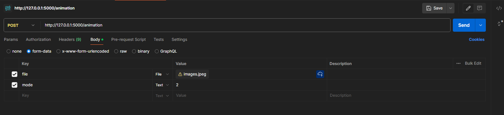
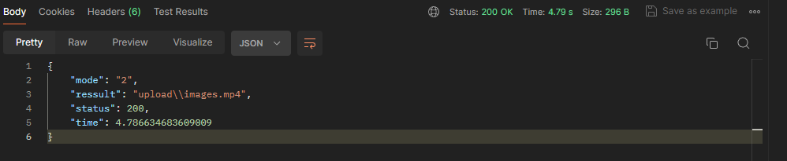

# Hướng dẫn cài đặt

## Tạo môi trường:
Để tạo môi trường chạy lệnh sau:
```
python -m venv .venv
```

Khởi động môi trường:

1) <i>Windows</i> ```.\.venv\Scripts\activate``` sau đó chọn `R` bấm `Enter`/
1) <i>Ubuntu/Mac</i> ```.\.venv\bin\activate``` sau đó chọn `R` bấm `Enter` (nếu có yêu cầu)/

## Installation

Yêu cầu ```python3```. Cài đặt các thư viện liên quan:
```
pip install -r requirements.txt
``` 

## Pre-trained checkpoint
Download checkpoint ```vox-cpk.pth.tar``` tại đây: [google-drive](https://drive.google.com/file/d/1_v_xW1V52gZCZnXgh1Ap_gwA9YVIzUnS/view?usp=drive_link).

Sau khi download đặt checkpoint theo đường dẫn ```ckpt/vox-cpk.pth.tar```

Lưu ý: nếu chưa có thư mục `ckpt` vui lòng tạo thư mục `ckpt`.

# Hướng dẫn chạy API

Để khởi động API chạy lệnh:
```
python app.py
```

## Chạy API bằng Postman

API: `http://127.0.0.1:5000/animation`

Methos: `POST`

Các mode thực hiện: `1: Nhắm mắt `, `2: Cười `, `3: Xoay trái `, `4: Xoay phải `.



Kết quả sẽ ở tại thư mục: `upload/`.


